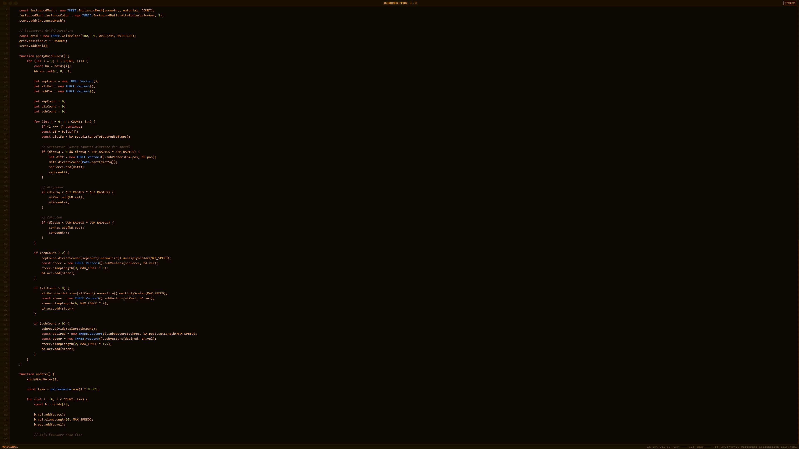
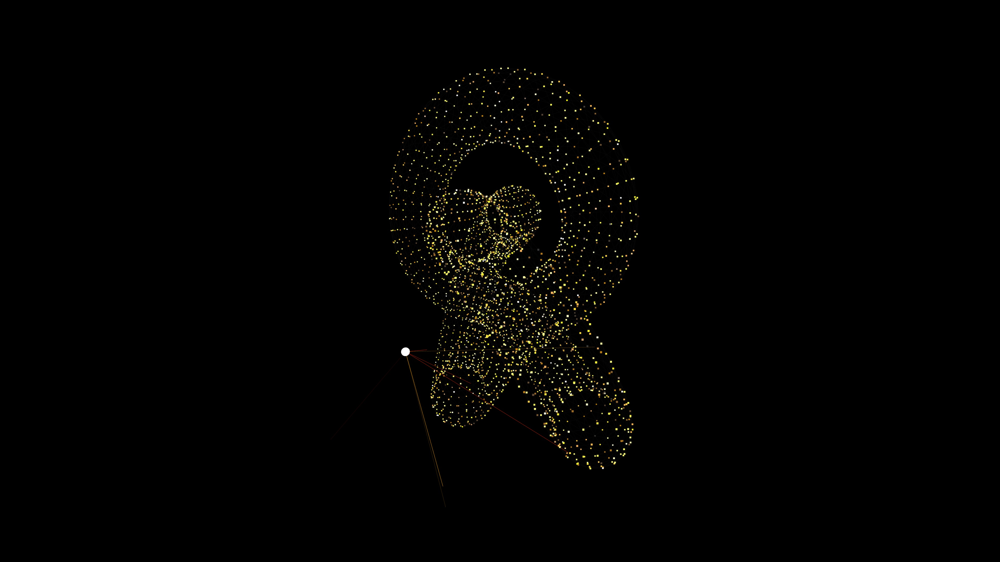

# AI Demoscener

A self-running kiosk that uses a local LLM to endlessly generate and display Three.js demoscene effects. The system writes code on screen in a retro mock-OS editor, validates the result, and archives everything that passes.

**Live demo (static archive player):** https://rowanunderwood.github.io/auto_demo_scener/





---

## How it works

1. **Generate** — picks an effect from the prompt library (or invents one), streams the LLM output to a retro code-editor display
2. **Validate** — loads the generated HTML in a sandboxed iframe, checks for crashes and blank frames via a probe script
3. **Repair** — if the demo fails, sends the error back to the LLM for a fix (up to N attempts)
4. **Display** — runs the working demo full-screen for a configurable duration; a title card shows the effect name, description, and author model at the start
5. **Archive** — saves it with a timestamped filename, then loops

If all repair attempts are exhausted a styled **CRASHED / BLANK FRAME** overlay appears with a 5-second countdown before the next cycle starts automatically.

**Replay mode** plays back archived demos without any LLM traffic — useful for showcasing a collection.

---

## Quick start (Windows)

```
pip install flask flask-sock requests
```

Then double-click **`ai_demoscener/launch.bat`** — it downloads Three.js, starts the server, and opens the display page in your browser.

**Display:** `http://localhost:8080/display`  
**Config GUI:** `http://localhost:8080/config`

### Manual start (any OS)

```bash
cd ai_demoscener
python download_vendor.py      # one-time: vendor three.js locally
python app.py --launch
```

---

## Requirements

- Python 3.10+
- [LM Studio](https://lmstudio.ai/) running on the local network with a model loaded
- A modern browser with WebGL support (Chromium recommended for kiosk use)

No GPU required on the host machine — LM Studio handles inference, the browser handles WebGL rendering.

---

## Configuration

Edit settings at `http://localhost:8080/config` while the server is running. All changes take effect on the next cycle without a restart.

| Setting | Default | Description |
|---|---|---|
| LM Studio URL | `http://192.168.2.192:1234` | Address of your LM Studio instance |
| Model | — | Which model to use; or enable **Surprise Me** for random selection each cycle |
| Demo runtime | 60 s | How long each demo runs before the next cycle |
| Mode weights | stock 2 / creative 1 / update 1 | Probability of each generation sub-mode |
| Palette | Amber CRT | Display colour scheme (7 built-in options) |
| Max repair attempts | 2 | How many times to ask the LLM to fix a broken demo |
| Show title card | on | Brief overlay at the start of each demo with title, description, and model byline |
| Just-in-time titling | off | Generate title/description synchronously before display (adds a few seconds) |
| Show stats overlay | on | Persistent lower-left stats (runs · fails · deleted) during each demo |
| Stats overlay font size | 11 px | Configurable in the DISPLAY section |

### Generation modes

- **Stock** — implements a specific effect from `prompts.csv`
- **Creative** — given the full prompt list as inspiration, invents something new
- **Update** — takes a previous archive file and produces a fresh aesthetic take on it
- **Replay** — no generation; cycles through the archive

---

## Title cards

At the start of each demo a brief overlay shows:

- Effect **title** and one-line **description** (generated by the LLM, stored in `archive_index.json`)
- **Author model** byline (`by <model>` or *author unknown*)
- Failure stats for this effect and model (runs · fails · deleted · fail%)

Titles can be generated:
- **Just-in-time** (config toggle) — synchronously before display; falls back gracefully if LM Studio is unreachable
- **In background** (default) — during the display timer; saved to archive for future replay
- **Batch** — Config → Title Cards → *⚡ Generate All* groups demos by model to minimise LM Studio model-switching

---

## Failure rate tracking

The config GUI shows a **Failure Rate** accordion with three tables: by stock effect, by sub-mode, and by model. Failures (crashes and blank frames) and user deletions are tracked separately.

Delete a demo at any time:
- Press `d` while a demo is playing (both generate mode and replay mode)
- Or use the **Preview** accordion in the config GUI

---

## Display keyboard shortcuts

| Key | Action | Condition |
|---|---|---|
| `d` | Show delete confirmation | Any demo playing (generate or replay) |
| `Escape` | Dismiss confirmation dialog | Dialog open |

In **generate mode**, confirming delete discards the current demo before it reaches the archive. In **replay mode**, it permanently deletes the file from the archive.

---

## Static archive player

`ai_demoscener/archive/index.html` is a self-contained page that plays back your archived demos with no Python backend required — just a web server serving the `archive/` directory.

```
http://localhost/archive/
https://yourname.github.io/auto_demo_scener/ai_demoscener/archive/
```

It reads `archive_index.json`, shuffles the demos, and cycles through them automatically, showing effect name, title, description, model byline, and failure stats.

| Key | Action |
|---|---|
| `→` / `Space` | Skip to next demo |
| `←` | Go back to previous demo |

Add `?runtime=N` to the URL to change how long each demo displays (default: 60 seconds).

---

## Palettes

Seven built-in colour schemes selectable from the config GUI:

| Name | Vibe |
|---|---|
| `amber_crt` | Amber phosphor on near-black |
| `green_phosphor` | Classic VT220 green |
| `borland_blue` | White on Borland blue, yellow keywords |
| `solarized_dark` | Modern dark |
| `notepad_pp` | Light background, Notepad++ colours |
| `synthwave` | Magenta/cyan/purple with glow |
| `mac_classic` | Black & white Chicago-style |

---

## Model benchmark

Failure rates across 29 models tested on Three.js demo generation. Sorted alphabetically; **Del** = user deletions (not counted in Fail %).

| Model | Runs | Fails | Del | Fail % |
|---|---:|---:|---:|---:|
| aescoder-4b | 2 | 1 | 0 | 🟠 50.0% |
| gemma-4-31b-it | 7 | 2 | 0 | 🟡 28.6% |
| gemma-4-e4b-it-heretic | 9 | 6 | 0 | 🔴 66.7% |
| google/gemma-4-26b-a4b | 6 | 2 | 0 | 🟡 33.3% |
| google/gemma-4-e4b | 4 | 1 | 0 | 🟡 25.0% |
| gpt-oss-20b | 3 | 2 | 1 | 🔴 66.7% |
| huihui-qwen3-vl-8b-instruct-abliterated | 4 | 2 | 0 | 🟠 50.0% |
| liquid/lfm2-24b-a2b | 7 | 7 | 0 | 🔴 100.0% |
| lmstudio-community/qwen3.5-35b-a3b | 4 | 2 | 0 | 🟠 50.0% |
| magistral-small-2509 | 3 | 2 | 0 | 🔴 66.7% |
| mistralai/devstral-small-2507 | 5 | 3 | 0 | 🔴 60.0% |
| nvidia-nemotron-nano-9b-v2 | 3 | 3 | 0 | 🔴 100.0% |
| qwen/qwen3-vl-30b | 9 | 3 | 0 | 🟡 33.3% |
| qwen/qwen3-vl-4b | 9 | 8 | 0 | 🔴 88.9% |
| qwen/qwen3-vl-8b | 6 | 4 | 1 | 🔴 66.7% |
| qwen/qwen3.5-9b | 5 | 2 | 0 | 🟡 40.0% |
| qwen/qwen3.6-27b | 6 | 3 | 0 | 🟠 50.0% |
| qwen/qwen3.6-35b-a3b | 5 | 1 | 0 | 🟢 20.0% |
| qwen3-30b-a3b-instruct-2507 | 7 | 4 | 0 | 🔴 57.1% |
| qwen3-30b-a3b-thinking-2507 | 6 | 0 | 0 | ✨ 0.0% |
| qwen3-coder-30b-a3b-instruct | 5 | 2 | 0 | 🟡 40.0% |
| qwen3-vl-8b-instruct-abliterated-v2.0 | 4 | 2 | 1 | 🟠 50.0% |
| qwen3.5-9b-abliterated | 9 | 8 | 0 | 🔴 88.9% |
| qwen3.6-35b-a3b-uncensored-hauhaucs-aggressive | 3 | 0 | 0 | ✨ 0.0% |
| qwen_qwen3-30b-a3b-thinking-2507 | 6 | 2 | 1 | 🟡 33.3% |
| text-embedding-nomic-embed-text-v1.5 | 4 | 0 | 0 | — |
| unsloth/qwen3-vl-30b-a3b-instruct | 6 | 4 | 1 | 🔴 66.7% |
| unsloth/qwen3.5-35b-a3b | 4 | 2 | 0 | 🟠 50.0% |
| zai-org/glm-4.7-flash | 4 | 0 | 3 | ✨ 0.0% |

🔴 ≥50% · 🟠 35–49% · 🟡 20–34% · 🟢 <20% · ✨ 0% · — non-code model

**Observations:** Thinking/reasoning models (`*-thinking-*`) tend to score noticeably better. VL (vision-language) models tuned for code show highly variable quality. Abliterated variants perform similarly to their base models.

---

## Project layout

```
ai_demoscener/
├── app.py              Flask server + WebSocket hub + all API routes
├── orchestrator.py     Generation state machine (IDLE → GENERATE → DISPLAY → ARCHIVE)
├── lm_client.py        LM Studio streaming API client
├── validator.py        Probe injection, fence-stripping, validation sync
├── archive.py          Save / version / prune / delete archived demos; archive_index.json
├── stats.py            Run/failure/deletion tracking per effect+model → prompt_stats.json
├── config.py           Config load/save with deep-merge defaults; atomic write
├── prompts.csv         83 effect specifications fed to the LLM
├── launch.bat          Windows one-click launcher
├── download_vendor.py  Fetches three.js into static/three/
├── archive/
│   └── index.html      Static archive player (no backend needed; GitHub Pages compatible)
└── static/
    ├── display.html/js/css   Kiosk display page (mock-OS + iframe + title card)
    └── config.html/js/css    Web config GUI
```

Runtime-generated (excluded from repo): `config.json`, `prompt_stats.json`, `debug.log`, `temp/`, `static/three/`, `archive/*.html`, `archive/archive_index.json`.

---

## Raspberry Pi kiosk

The plan doc (`ai_demoscener_plan.md`) contains full instructions for running as a zero-touch fullscreen kiosk on a Pi 4/5 using systemd and Chromium in kiosk mode.

---

## Licence

MIT
